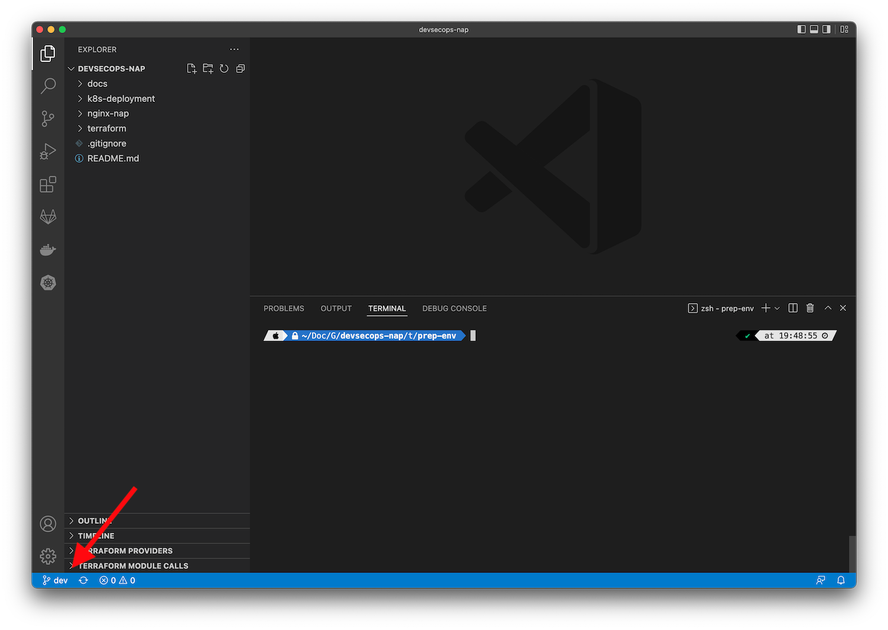
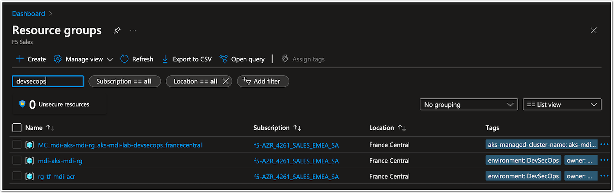

Lab 1 - Create Azure Container Registry and Kubernetes Cluster
##############################################################

Fork the workshop repo in your own GitHub account
*************************************************

All the workshop materials are located in this repo : https://github.com/MattDierick/devsecops-nap

Fork it in you own GitHub repo and create a ``dev`` branch. During all the workshop, we will stay in the dev branch. Keep the main branch as it is, in case you want to replicate this workshop later on.

|

Clone the repo in your laptop
*****************************

Use your favorite Git tool to clone ``your repo`` (don't clone this one https://github.com/MattDierick/devsecops-nap). Yours should looks like this https://github.com/<your_account>/devsecops-nap
If you don't know which tool to use, you can use VSCode with the Git extension. 

Check you are in the ``dev branch`` before continuing.

|

Run the Terraform plan to create the Azure objects
**************************************************

Go to ``terraform/prep-env`` directory and run these commands:

* Authenticate/login your terminal/laptop with your Azure tenant

  .. code-block:: bash

     az login
     az account set --subscription <subscription-ID>

* Go to ``prep-env`` folder
* Edit the ``parameters.tfvars`` folder with your own information
* Run the terraform plan. Type ``yes`` when prompted.

  .. code-block:: bash

   terraform init
   terraform plan -var-file=parameters.tfvars
   terraform apply -var-file=parameters.tfvars

WAIT !!!!!!

* After 5-10 minutes, the deployment must be finished and successful.

This terraform creates 3 Resource Groups:

* 2 RG for the AKS (xxx-ks-xxx-rg + another one created automatically by Azure)
* 1 RG for the ACR (rg-tf-xxx-acr)

* Collect the outputs (save them) for later actions

  .. code-block:: bash

    terraform output client_certificate
    terraform output client_key
    terraform output cluster_ca_certificate  
    terraform output acr_server
    terraform output acr_username
    terraform output acr_password

|

Connect your Docker engine and Kubectl context with Azure
*********************************************************

* In your Azure Portal, you can see your ACR. Its name is acr<prefix>, the prefix has been set in the ``parameters.tfvars``
* Connect your docker engine with Azure Container Registry ``acr<prefix>.azurecr.io``

  .. image:: ../pictures/lab1/acr.png
   :align: center

  .. code-block:: bash

   TOKEN=$(az acr login --name <your_registry> --expose-token --output tsv --query accessToken)
   docker login <your_registry>.azurecr.io --username 00000000-0000-0000-0000-000000000000 --password $TOKEN

Outcomes expected 

  .. code-block:: bash

  ❯ TOKEN=$(az acr login --name acrmdi.azurecr.io --expose-token --output tsv --query accessToken)
  WARNING: The login server endpoint suffix '.azurecr.io' is automatically omitted.
  WARNING: You can perform manual login using the provided access token below, for example: 'docker login loginServer -u 00000000-0000-0000-0000-000000000000 -p accessToken'
  
  ❯ docker login acrmdi.azurecr.io --username 00000000-0000-0000-0000-000000000000 --password $TOKEN
  WARNING! Using --password via the CLI is insecure. Use --password-stdin.
  Login Succeeded

* Save your kubeconfig file in a file

  .. code-block:: bash

    terraform output kube_config

* Merge or use this Kubeconfig file so that you can use your favorite k8s tool

   * Kubectl
   * Lens
   * k9s ...

.. note:: At least, run this command to be sure your kubectl is connected to your AKS context ``kubectl get nodes``

   