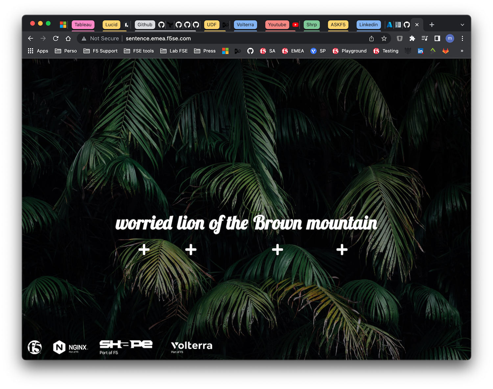

Lab 2 - Deploy the demo application
###################################

The application used in this workshop is very simple. It generates a sentence with 4 words coming from 4 different microservices.

You can find more details here : https://github.com/MattDierick/sentence-generator-app

|

Deploy the application in your AKS
**********************************

* Go to ``k8s-deployment`` directory
  
* Create the ``sentence`` namespace
  
  .. code-block:: bash
     
     kubectl create ns sentence

* Deploy the 2 manifests in ``sentence`` namespace

  .. code-block:: bash
      
     kubectl apply -f aks-sentence-deployment.yaml -n sentence
     kubectl apply -f aks-sentence-deployment-nginx-nolb.yaml -n sentence

.. note:: At this stage, we can considere DevOps pushed a new application in the Azure Kubernetes, and SecOps will have to expose this application with a Nginx App Protect.

* Check all pods and services are up and running

  .. code-block:: bash

     ❯ kubectl get pods -n sentence
      NAME                                       READY   STATUS    RESTARTS   AGE
      sentence-adjectives-5558f7d7d9-dkj58       1/1     Running   0          6d4h
      sentence-animals-6496766bc8-x5f4n          1/1     Running   0          6d5h
      sentence-backgrounds-5f784ffd-vd6d6        1/1     Running   0          6d5h
      sentence-colors-5c4c4f8b89-785tb           1/1     Running   0          6d5h
      sentence-frontend-nginx-6fc654698c-ktgfc   1/1     Running   0          6d5h
      sentence-generator-54b5687b54-nrf7h        1/1     Running   0          6d5h
      sentence-locations-bd85f5b7-9bt4n          1/1     Running   0          6d4h

     ❯ kubectl get services -n sentence
      NAME                      TYPE           CLUSTER-IP     EXTERNAL-IP     PORT(S)        AGE
      sentence-adjectives       ClusterIP      10.0.175.176   <none>          80/TCP         6d5h
      sentence-animals          ClusterIP      10.0.163.130   <none>          80/TCP         6d5h
      sentence-backgrounds      ClusterIP      10.0.71.153    <none>          80/TCP         6d5h
      sentence-colors           ClusterIP      10.0.160.97    <none>          80/TCP         6d5h
      sentence-frontend-nginx   ClusterIP      10.0.36.129    <none>          80/TCP         6d5h
      sentence-generator        ClusterIP      10.0.218.182   <none>          80/TCP         6d5h
      sentence-locations        ClusterIP      10.0.98.74     <none>          80/TCP         6d4h

