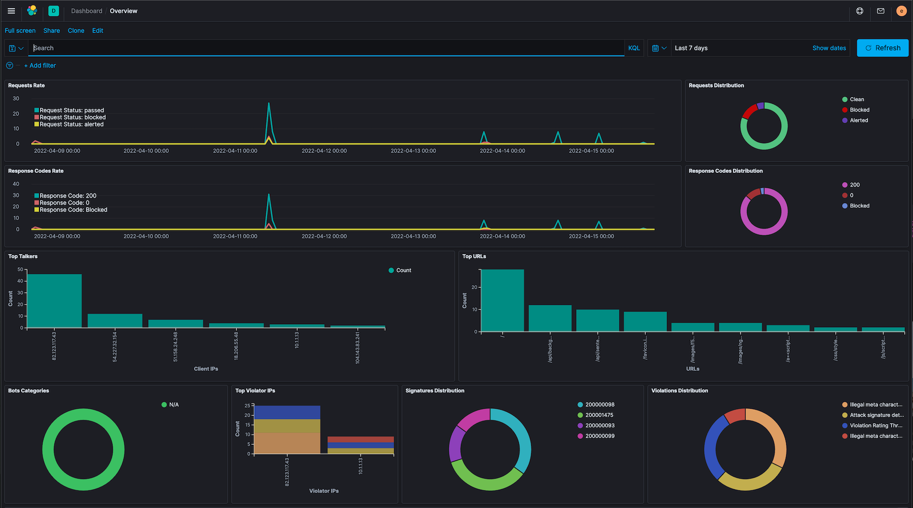

Lab 3 - Deploy an ECK with Logstash in your AKS
###############################################

In order to visualize your security events, you can deploy an ECK (Elastic Cloud Kibanba) in your AKS. We will deploy logstash aslo to parse the syslog messages.

|

Deploy ECK with Logstash
************************

The current deployment is done manually but we have been working on an Helm chart to deploy it quickly.

* Go to k8s-deployment/ECK directory and execute all the commands and manifests below:

  .. code-block:: bash

     kubect apply -f all-in-one.yaml
     kubect apply -f elasticsearch.yaml
     kubectl create secret generic kibana-saved-objects-encrypted-key --from-literal=xpack.encryptedSavedObjects.encryptionKey=12345678901234567890123456789012
     kubectl apply -f kibana.yaml
     kubectl apply -f logstash-cm.yaml
     kubectl apply -f logstash.yaml
     kubectl apply -f logstash-service.yaml

* Retrieve your ECK password, and save it somewhere

  .. code-block:: bash

     echo $(kubectl get secret elasticsearch-es-elastic-user -o go-template='{{.data.elastic | base64decode}}')

* Find your Logstash-lb public IP address

  .. code-block:: bash

     ❯ kubectl get services
      NAME                         TYPE           CLUSTER-IP     EXTERNAL-IP      PORT(S)                          AGE
      elasticsearch-es-default     ClusterIP      None           <none>           <none>                           107m
      elasticsearch-es-http        LoadBalancer   10.0.28.236    20.223.17.201    9200:31190/TCP                   107m
      elasticsearch-es-transport   ClusterIP      None           <none>           9300/TCP                         107m
      kibana-kb-http               LoadBalancer   10.0.253.12    20.223.250.186   443:31235/TCP                    104m
      kubernetes                   ClusterIP      10.0.0.1       <none>           443/TCP                          391d
      logstash                     ClusterIP      10.0.151.251   <none>           25826/TCP,5044/TCP               89m
      logstash-lb                  LoadBalancer   10.0.76.75     20.123.125.224   25826:32099/TCP,5044:31063/TCP   78m

* Push the NAP Dashboard into ECK (change the password value with your password and the IP address with the Logstash LB IP)

  .. code-block:: bash

      KIBANA_URL=https://<your-public-ip-kibana-lb>
      jq -s . overview-dashboard-bot.ndjson | jq '{"objects": . }' | \
         curl -k --location --user elastic:<your-password> --request POST "$KIBANA_URL/api/kibana/dashboards/import" \
         --header 'kbn-xsrf: true' \
         --header 'Content-Type: text/plain' -d @- \
         | jq

* Connect to your ECK https://<kibana-kb-http IP address> 
* Login is ``elastic`` and the password is the one from the steps above
* In Dashboard, select the ``Overview`` dashboard

