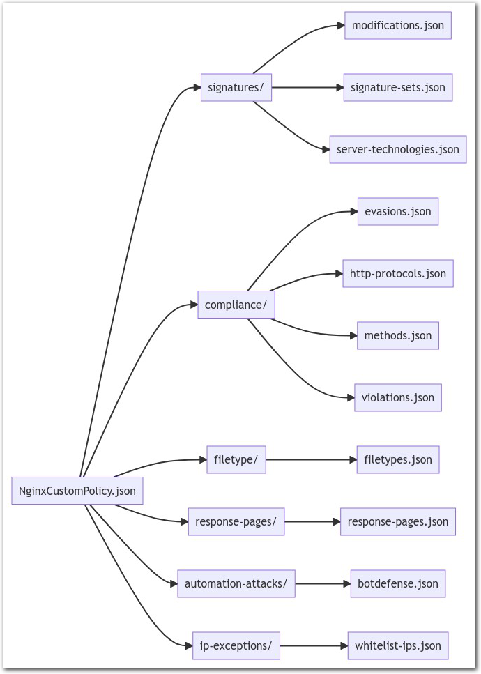

Lab 3 - Change the WAF blocking page
####################################

Let's do our first SecOps operation and simulate the DevSecOps operations. We will start by something simple, we will modify the WAF blocking page.

In order to simplify Security Operations, we created a ``tree`` or ``arboresence`` in order to spearate and split the Declarative WAF policy. You can see this arboresence in the ``nginx-nap/etc/nginx/nap-files/policies`` directory.

This arboresence makes the changes easy for every SecOps, as he knows exactly where to make the changes.

|

Modify the WAF blocking page
****************************

* Modify the ``nginx-nap/etc/nginx/nap-files/policies/custom-references/response-pages/response-pages.json`` file by making any change you want in the first section.

  .. code-block:: bash

    [
        {
            "responseContent": "<html><head><title>Reject Page</title></head><body>Your request was blocked by MY SUPER WAF.  Your support ID is: <%TS.request.ID()%>  <a href='javascript:history.back();'>[Go Back]</a></body></html>",
            "responseHeader": "HTTP/1.1 200 OK\r\nCache-Control: no-cache\r\nPragma: no-cache\r\nConnection: close",
            "responseActionType": "custom",
            "responsePageType": "default"
        },
        {
            "responsePageType": "ajax",
            "ajaxEnabled": true,
            "ajaxPopupMessage": "Your AJAX request was blocked. Your support ID is: <%TS.request.ID()%>"
        }
    ]

* Commit your change to the source of truth. This means you have to push your change into your GitHub repo. As a reminder, when the NAP boots, it clones your GitHub repo.

  * In VSCode, commit and push.

  .. image:: ../pictures/lab3/commit.png
     :scale: 50
     :align: center
     

  .. image:: ../pictures/lab3/push.png
     :scale: 50
     :align: center

* Make a quick look in your GitHub repo, dev branch, you should see your change here (the reponse blocking page change)

|

Simulate a CI pipeline execution
********************************

In this module, we do not use a CI tool (like Jenkins, Gitlab CI or Terraform Cloud). In this module, you will do it manually in order to understand the different steps.

The source of truth has a new config package to push to the infrastructure (the NAP). It is time to tell to the infra to "upgrade" with this new package.

In kubernetes, we name this process "rolling-upgrade". In order to be **immutable**, the rolling-upgrade will start a new NAP pod (with the new config from the source of truth), and will terminate the old one when the new pod is up and running.

* As the infra has been deployed with terraform, we will use terraform for the upgrade.
* In the terraform directory, execute a terraform apply

  .. code-block:: bash

      terraform apply -auto-approve

* Terraform is ``running`` a new pod and ``terminating`` the old one

  .. code-block:: bash

      kubectl get pods -n sentence

      ❯ kubectl get pods -n sentence
        NAME                                       READY   STATUS        RESTARTS   AGE
        nginx-nap-696bb4bdd7-zqtk5                 1/1     Running       0          31s
        nginx-nap-b5b74958d-tmtxn                  1/1     Terminating   0          63s
        sentence-adjectives-5558f7d7d9-dkj58       1/1     Running       0          6d6h
        sentence-animals-6496766bc8-x5f4n          1/1     Running       0          6d6h
        sentence-backgrounds-5f784ffd-vd6d6        1/1     Running       0          6d6h
        sentence-colors-5c4c4f8b89-785tb           1/1     Running       0          6d6h
        sentence-frontend-nginx-6fc654698c-ktgfc   1/1     Running       0          6d6h
        sentence-generator-54b5687b54-nrf7h        1/1     Running       0          6d6h
        sentence-locations-bd85f5b7-9bt4n          1/1     Running       0          6d6h

* Test your deployment by sending a new attack, and you should see your new custom blocking page.

