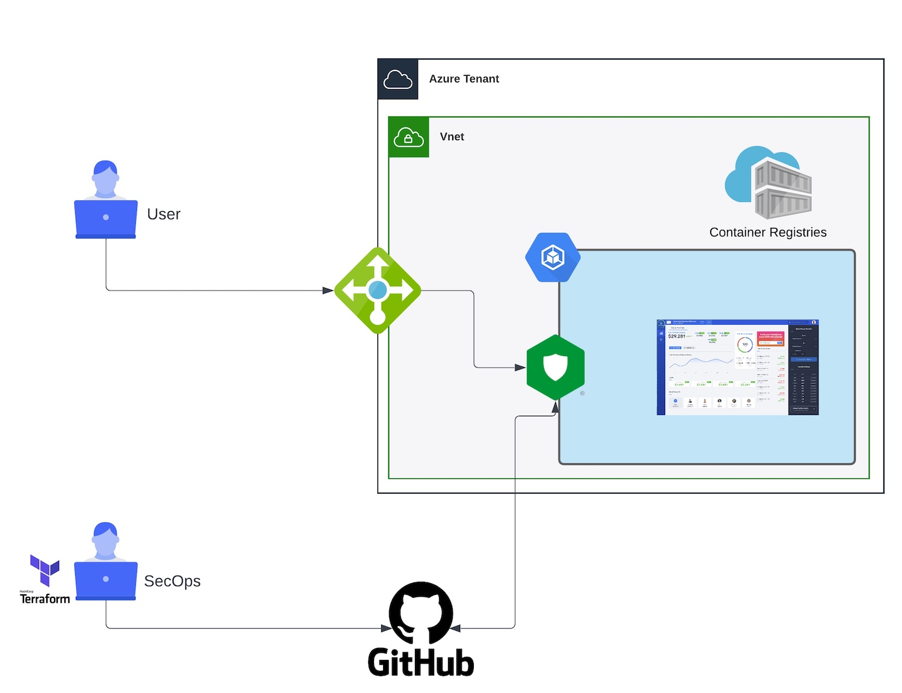

Module 2 - Deploy Nginx App Protect in your environment
#######################################################

In this module, we will deploy the Nginx App Protect in your AKS environment

* Build NAP image
* Deploy NAP image by simulating a CI pipeline
* Modify some NAP configuration settings and simulate a CI pipeline

**Module 2 - All sections**

.. toctree::
   :maxdepth: 1
   :glob:

   lab*/lab*

