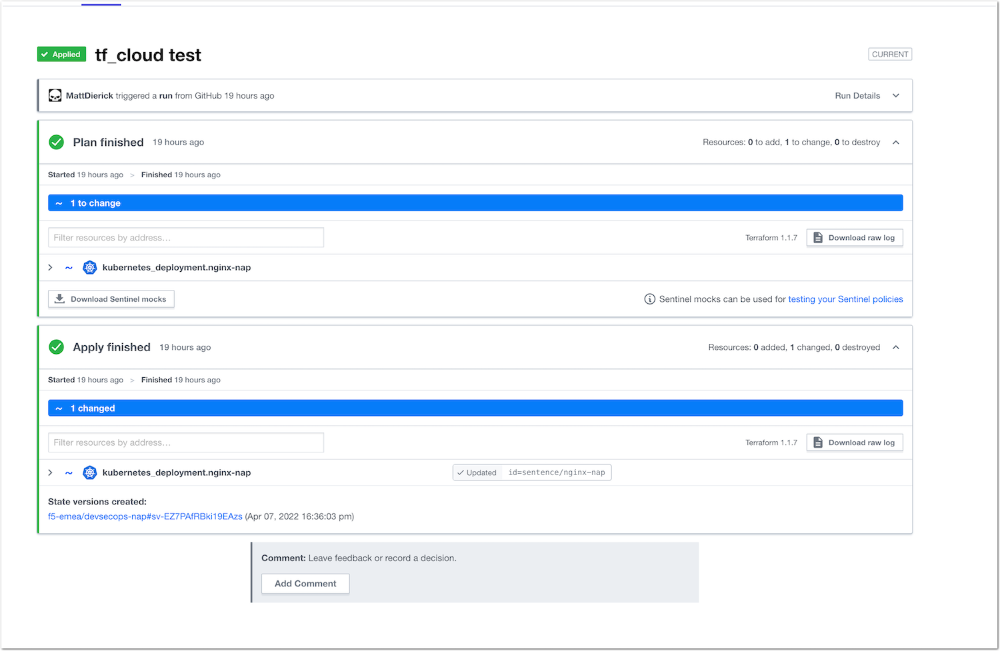

Lab 2 - Enjoy DevSecOps
#######################

It is time to test our full DevSecOps implementation. As a SecOps, we will now make a change in the source of truth (GitHub) and TF Cloud will take care of the rest (rolling-upgrade a new NAP pod)

* In your GitHub ``tf_cloud`` branch, make a new change. Let's say we want to enable Bot Protection
* In nginx-nap/etc/nginx/nap-files/policies/custom-references/automation-attacks/bot-defense.json ``enable`` the feature by changing from ``false`` to ``true``
* Commit and push

* That's it :) Look at your TF Cloud runs and you should see a new run in progress and in your AKS a new pod up and running.

