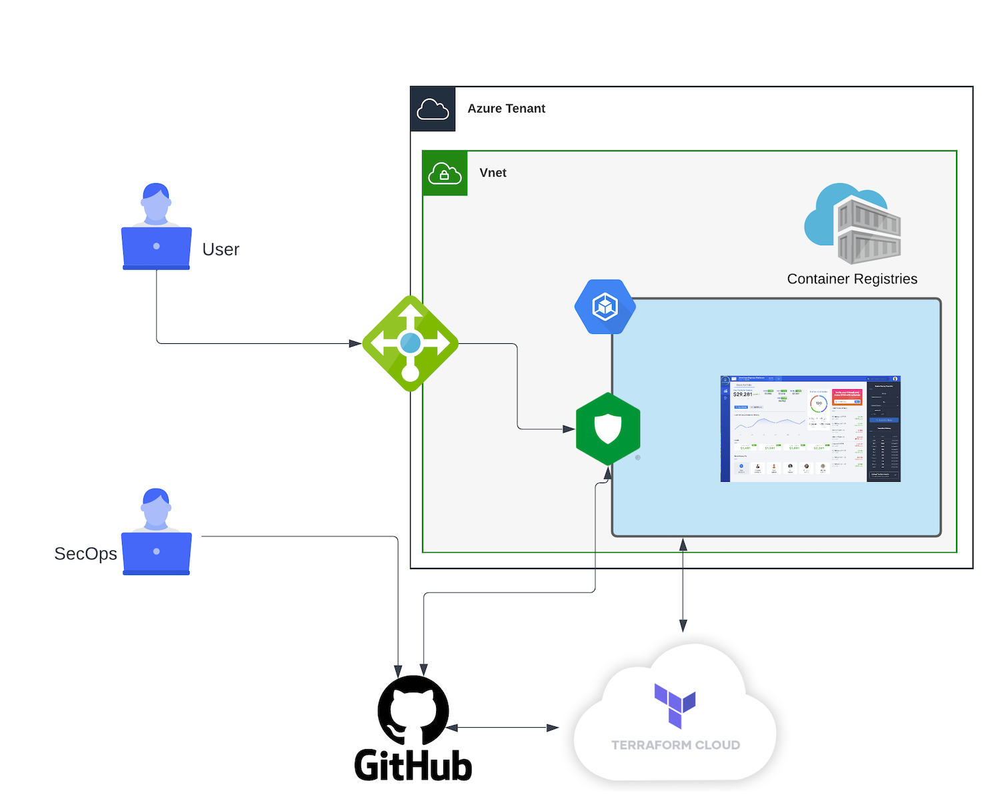

Module 3 - DevSecOps Workflow
#############################

In this section, we will run a real and full DevSecOps workflow when SecOps needs to make a change in the security policy. To do so , we will use Terrafom Cloud as CI.

In this section, when a SecOps will make/commit and change in the source of truth (GitHub), the CI tool with runa pipeline to rolling-update the NAP automatically.

**Module 3 - All sections**

.. toctree::
   :maxdepth: 1
   :glob:

   lab*/lab*

