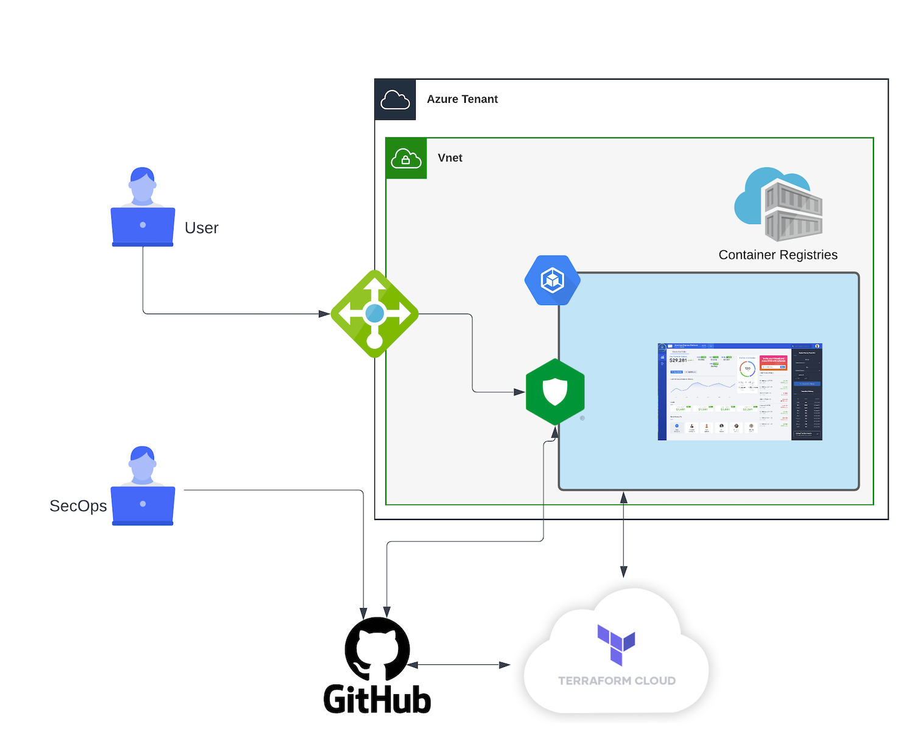

DevSecOps Workshop in Azure
===========================

Welcome
-------

.. warning:: Workshop under construction

Welcome to the |classbold| - |year|

|repoinfo|

This workshop is focused on DevSecOps methodolgy with Nginx solutions.
It covers:

* The deployment of the workshop environment in Azure via Terraform ``(Module 1)``
  
  * Azure Container Registry to store your Nginx App Protect docker images
  * Azure Kubenetes Cluster

* Understanding of DevSecOps methodology with Nginx solutions and you will be the CI pipeline (manuel apply) ``(Module 2)``

  * Github as source of truth
  * Terraform as infra and config as code
  * Yourself as a CI

* DevSecOps methodology with Nginx solutions with Terraform Cloud ``(Module 3)``

  * Github as source of truth
  * Terraform as infra and config as code
  * Terraform Cloud as a CI

Pre-reqs:

* An Azure tenant with the subscription
* Azure CLI
* Kubectl CLI and/or k8s tools like Lens/k9s
* Nginx App Protect license
* Terraform
* Docker desktop or CE
  
  * As a reminder, Docker Desktop is not free anymore for organizations
  * For F5ers, you can learn how to install Docker CE on Mac and Windows here https://f5.sharepoint.com/sites/CoP-ModernApps/SitePages/replace-Docker-Desktop-on-macOS-and-Windows.aspx  

.. toctree::
   :maxdepth: 3
   :caption: Contents:
   :glob:

   class*/class*
